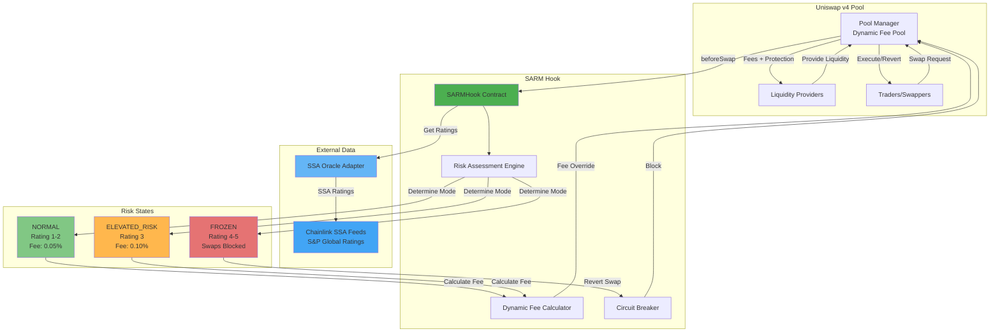
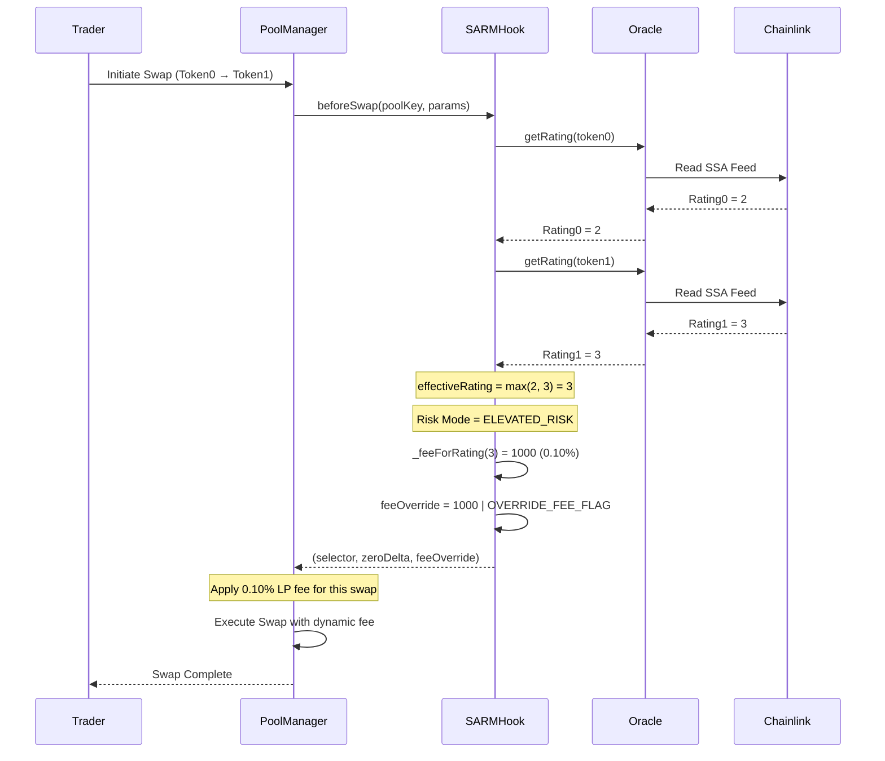

# SARM Protocol - Architecture Overview

## Overview

**SARM (Stablecoin Automated Risk Management)** es un hook inteligente para Uniswap v4 que hace que la liquidez de stablecoins sea consciente del riesgo. Integra calificaciones de crédito en tiempo real de S&P Global SSA (Stablecoin Stability Assessment) para ajustar dinámicamente las comisiones de los LP y aplicar circuit breakers cuando el riesgo es elevado.

## ¿Qué hace SARM?

SARM protege a los LPs (Liquidity Providers) y traders de stablecoins de riesgo mediante:

1. **Risk Gating**: Bloquea swaps cuando los stablecoins tienen ratings de alto riesgo (depeg inminente)
2. **Dynamic Fees** (Phase 2): Ajusta las comisiones LP basándose en el nivel de riesgo
3. **Real-time Monitoring**: Integración con oráculos Chainlink SSA para ratings actualizados

### Modos de Riesgo

```
Rating 1-2  → NORMAL         → Fees competitivas (0.05%)
Rating 3    → ELEVATED_RISK  → Fees moderadas (0.10%)
Rating 4-5  → FROZEN         → Swaps bloqueados (Circuit breaker)
```

## Arquitectura del Sistema



## Flujo de un Swap



## Componentes Clave

### 1. SARMHook Contract

El contrato principal que implementa la lógica de risk management:

- **beforeSwap**: Intercepta cada swap para evaluar riesgo
- **Risk Mode Determination**: Calcula el modo de riesgo basado en ratings
- **Dynamic Fee Calculation**: Ajusta fees según el nivel de riesgo
- **Circuit Breaker**: Bloquea swaps cuando el riesgo es crítico

**Funciones principales:**
- `_beforeSwap()`: Hook principal que se ejecuta antes de cada swap
- `_feeForRating()`: Mapea ratings a comisiones LP
- `_determineRiskMode()`: Determina el modo de riesgo actual
- `_getRating()`: Obtiene ratings del oracle con error handling

### 2. SSA Oracle Adapter

Interfaz con los feeds de Chainlink que proveen ratings de S&P Global:

- Mock implementation para testing
- Integración real con Chainlink SSA feeds para producción
- Provee ratings de 1-5 para cada stablecoin
- Incluye timestamp de última actualización

**Rating Scale:**
- 1: Excelente estabilidad
- 2: Buena estabilidad
- 3: Estabilidad moderada (requiere monitoreo)
- 4: Alto riesgo de depeg
- 5: Depeg crítico/inminente

### 3. Risk Assessment Engine

Lógica que determina el comportamiento del pool basado en ratings:

```solidity
function _determineRiskMode(uint8 effectiveRating) internal view returns (RiskMode) {
    if (effectiveRating >= riskConfig.frozenThreshold) {
        return RiskMode.FROZEN;  // 4-5: Block swaps
    } else if (effectiveRating >= riskConfig.elevatedRiskThreshold) {
        return RiskMode.ELEVATED_RISK;  // 3: Higher fees
    } else {
        return RiskMode.NORMAL;  // 1-2: Normal operation
    }
}
```

### 4. Dynamic Fee Calculator (Phase 2)

Mapea ratings a comisiones LP apropiadas:

| Rating | Risk Level | LP Fee | Basis Points |
|--------|-----------|--------|--------------|
| 1-2    | NORMAL    | 500    | 0.05% (5 bps) |
| 3      | ELEVATED  | 1000   | 0.10% (10 bps) |
| 4+     | FROZEN    | 3000   | 0.30% (30 bps)* |

*Rating 4+ típicamente resulta en swaps bloqueados, pero si se implementan excepciones, tendrían fees muy altos.

## Eventos del Sistema

### RiskCheck
```solidity
event RiskCheck(PoolId indexed poolId, uint8 rating0, uint8 rating1, uint8 effectiveRating);
```
Emitido en cada swap para analytics y monitoring.

### RiskModeChanged
```solidity
event RiskModeChanged(PoolId indexed poolId, RiskMode newMode);
```
Emitido cuando un pool cambia de modo de riesgo.

### FeeOverrideApplied (Phase 2)
```solidity
event FeeOverrideApplied(PoolId indexed poolId, uint8 effectiveRating, uint24 fee);
```
Emitido cuando se aplica un fee dinámico basado en riesgo.

## Beneficios del Sistema

### Para Liquidity Providers:
- **Protección contra depeg**: Circuit breaker automático
- **Compensación por riesgo**: Fees más altas cuando el riesgo aumenta
- **Transparencia**: Eventos on-chain para tracking de riesgo

### Para Traders:
- **Seguridad**: Protección contra pools de alto riesgo
- **Precios justos**: Fees ajustadas al nivel de riesgo real
- **Confianza**: Datos de S&P Global, el estándar de la industria

### Para el Protocolo:
- **Reputación**: Previene incidentes de depeg
- **Sostenibilidad**: LPs retienen liquidez incluso en condiciones de riesgo
- **Innovación**: Primera implementación de credit ratings en DeFi de forma nativa

## Roadmap

- [x] **Phase 1**: Risk Gating con circuit breakers
- [ ] **Phase 2**: Dynamic fees basadas en ratings (En implementación)
- [ ] **Phase 3**: Integración con Chainlink SSA feeds reales
- [ ] **Phase 4**: Dashboard y analytics frontend
- [ ] **Phase 5**: Governance y parámetros ajustables

## Stack Técnico

- **Smart Contracts**: Solidity 0.8.26
- **Framework**: Foundry
- **Uniswap v4**: Hooks, PoolManager, Dynamic Fees
- **Oracles**: Chainlink (SSA feeds planned)
- **Testing**: Forge test suite
- **Dependencies**: 
  - v4-core
  - v4-periphery
  - OpenZeppelin Contracts

---

**Built for ETHGlobal Buenos Aires 2025**
